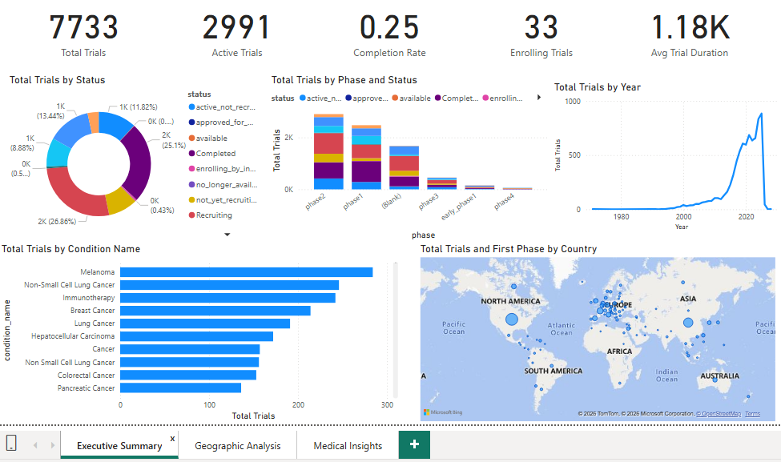
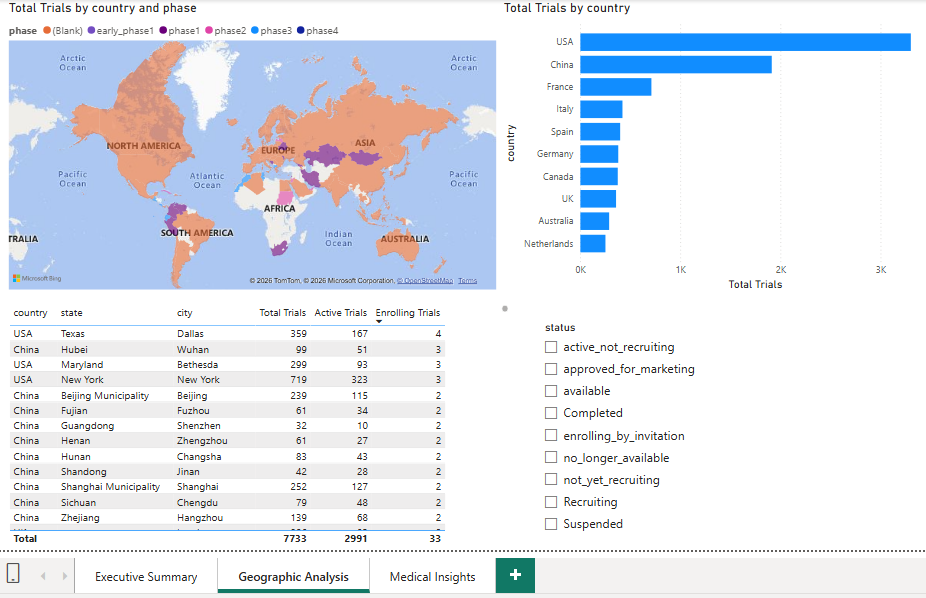
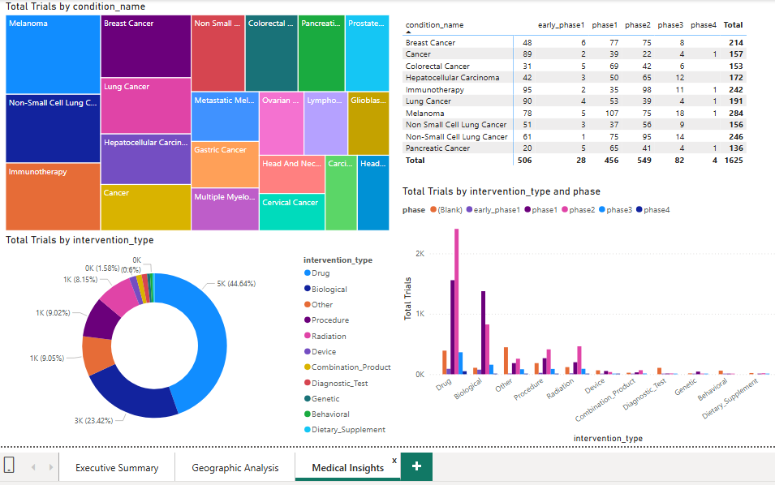

# Clinical_trials_dashboard_power_bi_project

## 📋 Project Overview

Building a comprehensive Power BI dashboard for analyzing clinical trial data extracted from ClinicalTrials.gov, featuring 7,733+ clinical trials with their locations, conditions, and interventions. Utilized python programming, mysql and powerbi.

## 🚀 Features

**Interactive Dashboard:** 3-page Power BI dashboard with executive summary, geographic analysis, and medical insights

**Primary Data Source:** ClinicalTrials.gov API

**Data Pipeline:** Automated extraction, cleaning, and MySQL database import

**Real-time Analytics:** 15+ calculated measures including trial completion rates, active trials, and average duration

**Geospatial Visualization:** Country-wise trial distribution on interactive maps

**Medical Analysis:** Condition and intervention analysis with treemaps and matrix visuals

## 📁 Project Structure

```
clinical-trials-dashboard/
│
├── data_pipeline/
│   ├── clinicaltrials_extract.py     # Extract data from ClinicalTrials.gov
│   ├── Clean_files.py                # Initial data cleaning
│   ├── Clean_files2.py               # Enhanced cleaning (NaN handling)
│   ├── SQL_script                    # MySQL database creation script
│   └── SQL3.py                       # Database import script
│
├── database/
│   └── clinical_trials.sql           # Database schema
│
├── powerbi/
│   ├── Clinical_Trials_Dashboard.pbix  # Power BI dashboard file
│
└── README.md
```

## ⚙️ Setup Instructions

### Prerequisites

Python 3.8+ with pip

MySQL Server 8.0+

Power BI Desktop

MySQL Connector/NET 9.5.0 (for Power BI connection)

### Methodology

Open Windows Power Shell and follow the below steps-

**Step 1: Python Environment Setup**
```
# Install required Python packages

pip install pandas
pip install mysql-connector-python
pip install numpy
```

**Step 2: Extract Data**
```
# Navigate to the project directory

cd <Path to your project directory>

# Run extraction script

python clinicaltrials_extract.py
```

Expected Output:
Trials data written to: trials.csv
Locations data written to: locations.csv
Conditions data written to: conditions.csv
Interventions data written to: interventions.csv

**Step 3: Clean and Prepare Data**
```
# Clean files for MySQL import

python Clean_files.py
python Clean_files2.py  # Additional NaN cleaning
```

Open MySQL Workbench and follow the below step-

**Step 4: MySQL database creation**

Create database named clinical_trials and tables named trials, locations, conditions and interventions according to the SQL_script.

After this, open Windows Power Shell and follow the below step-

**Step 5: Import to MySQL**
```
# Import cleaned data to MySQL

python SQL3.py
```

Expected Output:
🚀 Starting MySQL Import with MySQL-Ready Files...
...
🎉 All data imported successfully!

Open Microsoft Power BI Desktop and follow the below steps-

**Step 6: Power BI Configuration**

Configure Global Settings:

Options → Global → Data Load → Type Detection → Never detect column types and headers for unstructured sources

Configure Regional Settings:

Current File → Regional Settings → Select English (US)

Leave DAX separators as default

Enable Preview Features:

Enable On-object interaction

Restart Power BI

**Step 7: Connect Power BI to MySQL**

Get Data → MySQL database

Connection Details:

Server: localhost

Database: clinical_trials

User: root

Password: [Your MySQL Password]

Load all 4 tables

Verify relationships in Model view

### 📈 DAX Measures Implemented**

**Key Performance Indicators**

Total Trials = COUNTROWS('clinical_trials trials')
Active Trials = CALCULATE([Total Trials], clinical_trials trials[status] IN {"Recruiting","active_not_recruiting"})
Completed Trials = CALCULATE([Total Trials], clinical_trials trials[status] = "Completed")
Completion Rate = DIVIDE([Completed Trials], [Total Trials], 0)
Active Rate = DIVIDE([Active Trials], [Total Trials], 0)

**Advanced Calculations**

Avg Trial Duration = 
AVERAGEX(
    FILTER(
        'clinical_trials trials',
        NOT ISBLANK('clinical_trials trials'[start_date]) &&
        NOT ISBLANK('clinical_trials trials'[completion_date]) &&
        'clinical_trials trials'[start_date] >= DATE(2000,1,1) &&
        'clinical_trials trials'[completion_date] <= TODAY()
    ),
    DATEDIFF(
        'clinical_trials trials'[start_date],
        'clinical_trials trials'[completion_date],
        DAY
    )
)

### 🎨 Dashboard Pages**

**Page 1: Executive Summary**

KPI Cards: Total Trials, Active Trials, Completion Rate, Enrolling Trials, Avg Trial Duration

Donut Chart: Total Trials by Status

Stacked Column Chart: Total Trials by Phase and Status

Line Chart: Total Trials by Year

Horizontal Bar: Top 10 Medical Conditions

World Map: Geographic Distribution

**Executive Summary Dashboard image**



**Page 2: Geographic Analysis**

Filled Map: Country-wise Trial Distribution

Table: Country-level Metrics

Bar Chart: Top 10 Countries

Pasted a multi-select slicer for selecting the trials based on trial status

**Geographic Analysis Dashboard image**



**Page 3: Medical Insights**

Treemap: Top 20 Medical Conditions

Donut Chart: Intervention Types

Matrix: Conditions vs Trial Phases

Clustered Column: Interventions by Phase

**Medical Insights Dashboard image**



**🔗 Data Model Relationships**

Trials (1) → (Many) Locations

Trials (1) → (Many) Conditions

Trials (1) → (Many) Interventions

## 📝 Troubleshooting

**Power BI MySQL Connection Failed**

Install MySQL Connector/NET 9.5.0

Restart Power BI

Verify MySQL service is running

**Python Module Errors**

```
pip install --upgrade pandas mysql-connector-python
```

**NaN Values in Database**

Run Clean_files2.py for thorough cleaning

**Slow Dashboard Performance**

Remove unnecessary columns in Power Query

Use aggregations where possible

## Author
**Shaurav Bhattacharyya**

- GitHub: @Shaurav20 (https://github.com/Shaurav20)
- LinkedIn: Shaurav Bhattacharyya (https://www.linkedin.com/in/shaurav-bhattacharyya-a347b5156/)
- Email: shaurav.feb@gmail.com

## 📄 License

This project is licensed under the MIT License. You are free to use, modify, and distribute this code with appropriate attribution.

**Notes:**
- Intended for educational and analytical purposes only
- Clinical trial data sourced from [ClinicalTrials.gov](https://clinicaltrials.gov/)

## Acknowledgments

- **ClinicalTrials.gov** for providing open-access clinical trial data
- **Power BI community** for visualization inspiration and techniques
- **MySQL & Python communities** for documentation and support resources

